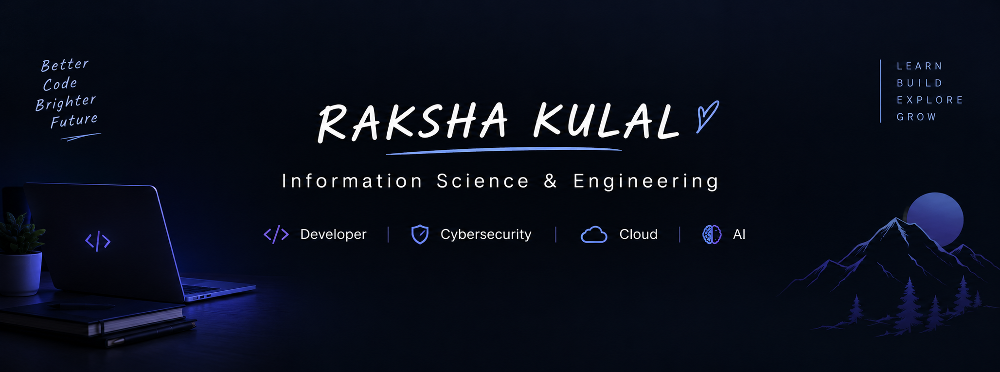

  

# Raksha Kulal 👋

### Information Science & Engineering Student • Developer • Tech Enthusiast

I'm Raksha Kulal, an Information Science and Engineering student interested in
software development, cybersecurity, cloud technologies, and AI.
I enjoy learning by building projects, experimenting with new technologies,
and turning ideas into practical solutions.

---

## About Me

- 🎓 B.E. Information Science and Engineering student
- 🏫 Mangalore Institute of Technology and Engineering (MITE)
- 💻 Interested in Software & Web Development
- 🔐 Exploring Cybersecurity
- ☁️ Exploring Cloud and AI technologies
- 🚀 Learning by building practical projects

---

## Connect With Me

  
  
  

---

## Technologies & Tools

### Languages

  

### Web Development

  

### Tools & Technologies

  

---

## Currently Learning

- ☁️ Cloud Computing
- 🔐 Cybersecurity
- 🤖 Artificial Intelligence
- 🌐 Full-Stack Web Development
- 💻 Data Structures & Algorithms

---

## Projects

### 🔐 INSIGHT — Insider Behavior Intelligence Dashboard

A cybersecurity dashboard designed to detect significant changes in user behavior and identify potentially risky account activity.

**Key Features**
- 📊 Behavior baseline and anomaly detection
- 🔍 Multi-signal correlation
- ⚠️ Context-aware risk analysis
- 📈 Explainable risk scoring
- 🕒 Investigation timeline and alerts

**Technologies:** React • Python • FastAPI • Firebase • Scikit-learn

---

### 🧾 Smart Warranty System

A web-based warranty management project designed to provide a simple way to organize digital purchase and warranty information.

**Technologies:** HTML

🔗 [View Project on GitHub](https://github.com/kulalraksha48-cloud/smart-warranty-system)

---

## Education

### 🎓 Bachelor of Engineering — Information Science & Engineering

**Mangalore Institute of Technology and Engineering (MITE)**  
Currently pursuing my undergraduate degree in Information Science & Engineering.

---

## Developer Quote

> "Learn by building, improve by experimenting, and grow with every project."

  

